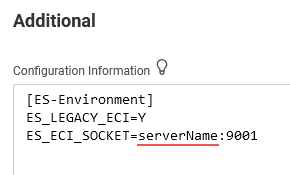
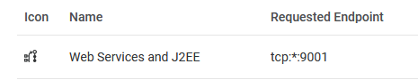

# EXEC CICS LINK Setup
1. Set the following environment variables in the 'Configuration Information' section of the region, replacing the server name and port to match your 'Web Services and J2EE' listener.    
    ```
    ES_LEGACY_ECI=Y
    ES_ECI_SOCKET=serverName:9001
    ```
      
      

2. Code the call in the batch program as an EXEC CICS LINK program call.   
    ```
    EXEC CICS LINK
        PROGRAM (WS-PROGRAM)
        COMMAREA (WS-COMMAREA)
        RETCODE (EXCI-EXEC-RETURN-CODE)
    END-EXEC
    ```
    [Documentation](https://www.microfocus.com/documentation/enterprise-developer/ed-latest/ED-VS2022/HCOMCMVIEWS003.html)  

3. Compile the calling program using the following compiler directive.  
    ```
    CICSECM(EXCI=YES)
    ```