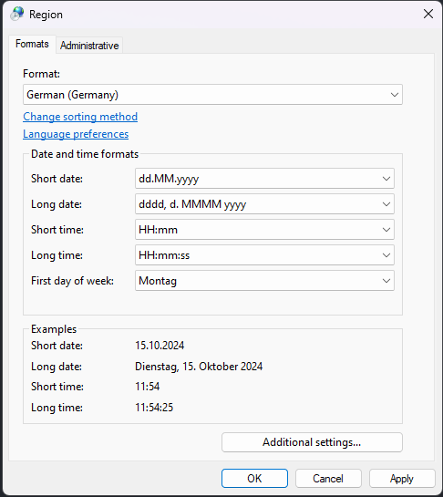
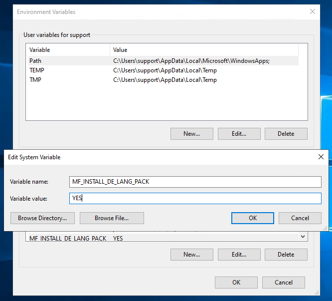

# Eclipse German Language Support

To enable German language support in Eclipse, before installing the product:

- Ensure the system's format settings are configured to either German (Germany) or German (Austria). Remember, the region (country) being set to German doesn't automatically adjust the format settings. If they aren't already set to German, you'll need to change them explicitly.   

- Set the system environment variable `MF_INSTALL_DE_LANG_PACK` to `YES` (case-insensitive).  

After product installation, to enable German language support in Eclipse, you can either set the system's display language to German or add the command-line argument '-nl de' (or include it in eclipse.ini).  