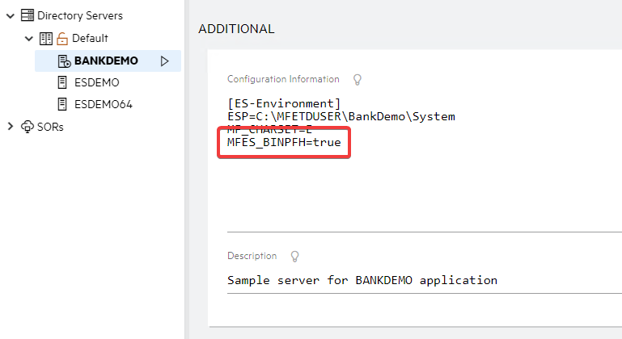
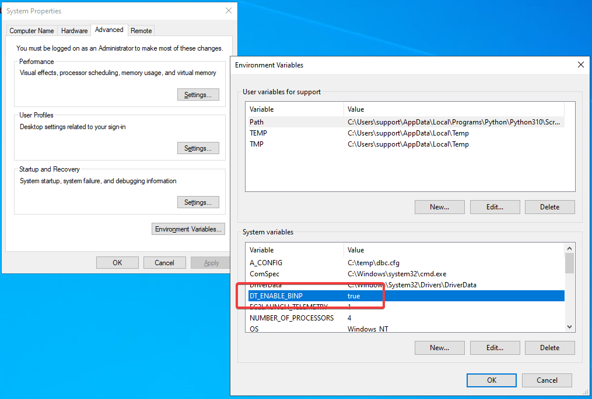
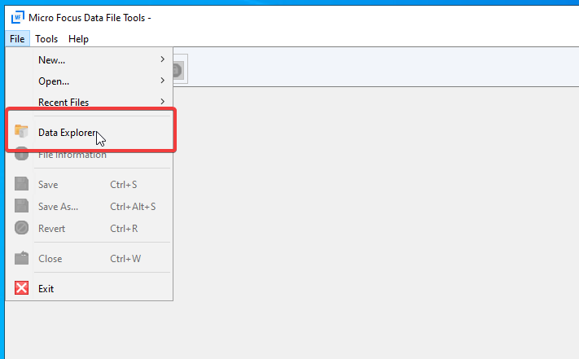
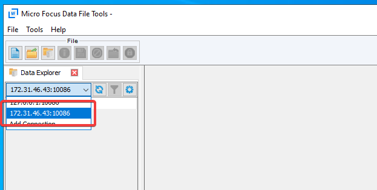
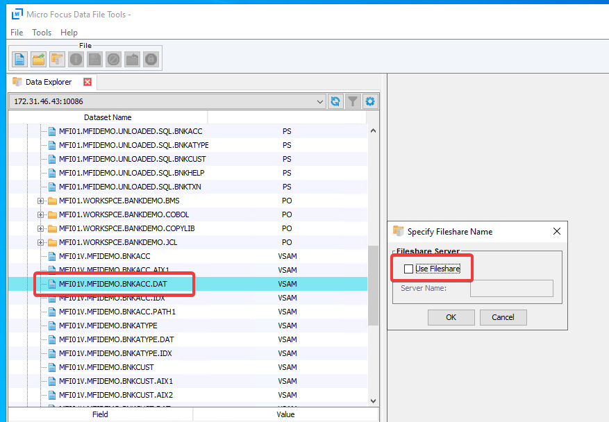
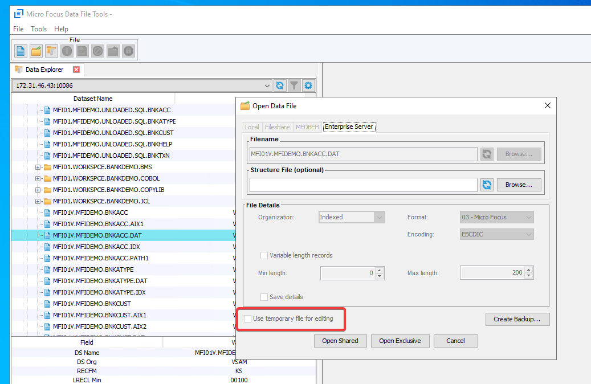

# Data Explorer using BINP  

This feature was added in version 7.0 PU 3  

1. On the server, set 'MFES_BINPFH=true' in Region Configuration Information.  

2. On the client machine, set the environment variable 'DT_ENABLE_BINP=true'.  

3. Open Micro Focus Data File Tools and navigate to File -> Data Explorer.  

4. In the connection drop down list, select your remote server.  

5. Expand the region you are working with and double click the data set/file you want to open. Make sure 'Use Fileshare' is unchecked and click OK.  

6. In the 'Open Data File' window, make sure 'Use temporary file for editing' is unchecked then click 'Open Shared'.  

**NOTES:**  

When the environment variable has been set on the client, you will no longer be able to use Fileshare with Data Explorer. To enable the use of Fileshare again you need to remove the environment variable restart Data File Tools.  

**Security:**  

Resources -> New Class  
Name: MFDFED  
Click resource -> New Resource  
Setup as desired for security.  
e.g.  
Name: **  
ACL: allow:* group:alter  
