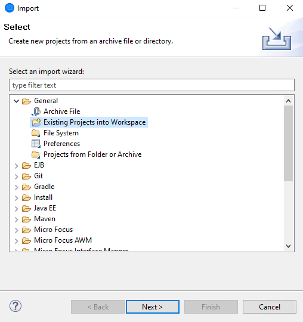
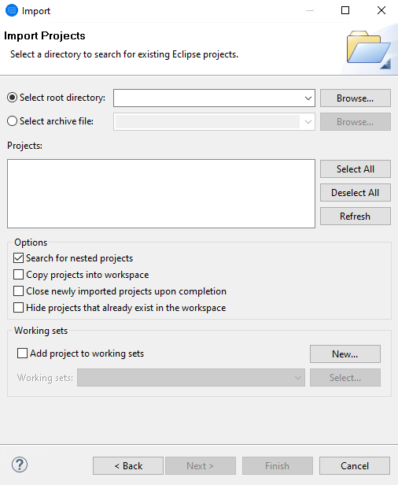
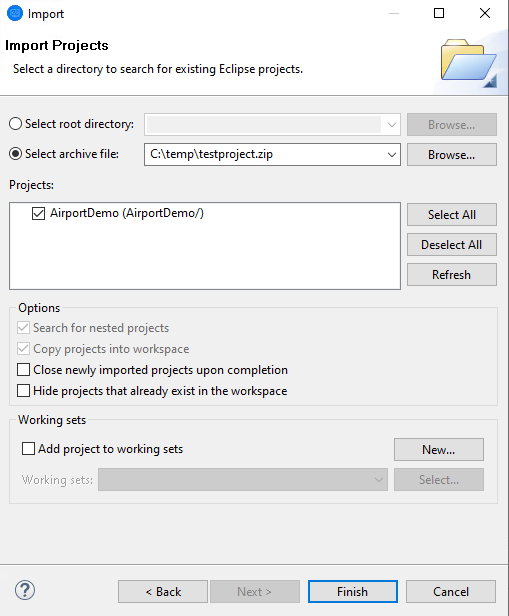
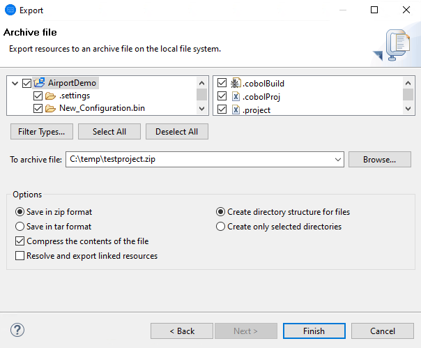

# Import/Export Project from Eclipse

## Import

1. In the IDE, click File > Import.  

2. In the Import dialog, expand General, click 'Existing Projects into Workspace' and click Next.   

     

3. On the Import Projects page of the Import dialog, click Browse next to 'Select archive file'. If you import the project from a folder click the 'Select root directory' and click the Browse button on the following dialog.

     

4. Navigate to and select the sample folder / archive file and click OK. This loads the available project or projects into the Projects pane. Ensure the required projects are selected.   

     

5. Check Copy projects into workspace and click Finish.  

## Export

To export an entire Eclipse project into an archive file, follow these steps.  

1. Go to File -> Export... The following dialog will appear. 

     

2. Select 'Archive File' in the list presented in the image above and click Next.  

3. The following window will appear. Click the checkbox next to the project you would like to export. From the 'Options' section, you can choose the archive format and other project related options.  

     

4. In the window above, click Finish. Eclipse will export and archive your project into an archive file and store it in the location specified.  