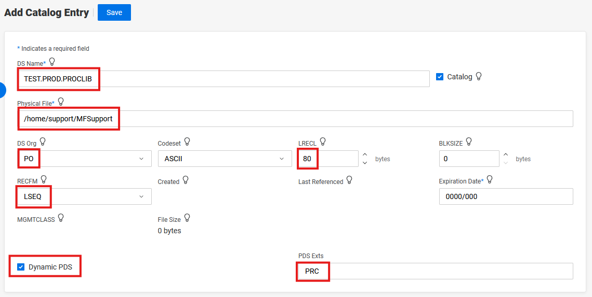

# JCL procedure using the JCLLIB statement

## Add Catalog Entry

 

Or using JCL:  

```
//MFTSTPDS JOB CLASS=A,MSGCLASS=A,MSGLEVEL=(1,1)
//*--------------------------------------------------------------------
//*        Create PO                          
//*--------------------------------------------------------------------
//STEP1    EXEC PGM=IEFBR14
//PDS      DD DSN=TEST.PROD.PROCLIB,
//            DISP=(NEW,CATLG),
//            SPACE=(CYL,(1,1),RLSE),
//            DCB=(DSORG=PO,RECFM=LSEQ,LRECL=80,BLKSIZE=0),
//*MFE: %PCDSN=/home/support/MFSupport/*.PRC
//*
```

## JCL Procedure and Job Details  

/home/support/MFSupport/SAMPL.PRC  
```
//SAMPL   PROC
//STEP1   EXEC PGM=IEFBR14  
//DD1     DD DSN=MFDATA,DISP=(NEW,CATLG),   
//          DCB=(RECFM=V,LRECL=123,DSORG=PS)
```

JCLLIB statement:
```
//MYJOB1 JOB CLASS=A,MSGCLASS=A,MSGLEVEL=(1,1)
//MYLIBS1  JCLLIB  ORDER=(TEST.PROD.PROCLIB)
//S1       EXEC    PROC=SAMPL
```