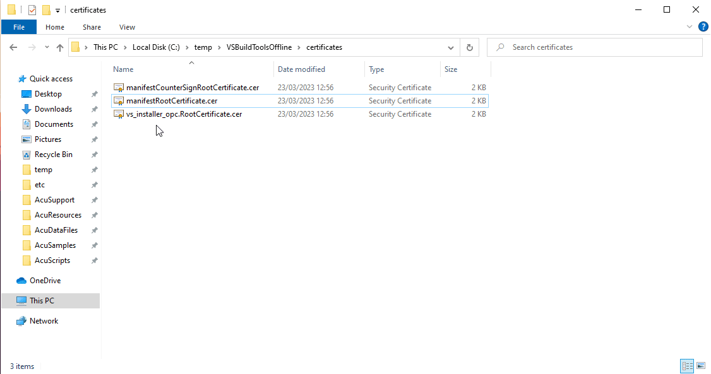

# MSTOOLS Offline Install

To install in an offline environment, an administrator with internet access must prepare by ensuring that all of the required installers, certificates, and licenses are available to the offline machine. For Enterprise Developer/Visual COBOL for Eclipse, this includes the Visual Studio Build Tools and some Microsoft certificates.  

## Create Offline Install Cache
On a machine with internet access, first download [Microsoft's Visual Studio Build Tools 2017](https://my.visualstudio.com/Downloads?q=build%20tools%202017&wt.mc_id=o~msft~vscom~older-downloads)  

Use the downloaded Visual Studio Build Tools installer to download the required layout files for the offline installation of Enterprise Developer/Visual COBOL.  

```
vs_BuildTools.exe --layout c:\VSBuildToolsOffline --add Microsoft.VisualStudio.Workload.VCTools Microsoft.VisualStudio.Component.Windows10SDK.17763 --lang en-US  
```

Where c:\VSBuildToolsOffline is an example folder in which you can create the offline install cache.  

Copy the c:\VSBuildToolsOffline folder to the offline machine on which you want to install Enterprise Developer/Visual COBOL.  

## Perform Offline Install
### Install certificates  
The required Microsoft certificates are placed in the certificates sub-folder of the Visual Studio layout folder you created in the previous steps (i.e. c:\VSBuildToolsOffline\certificates).  

You can manually install the certificates by right-clicking each of the certificate files, selecting **Install Certificate**, and then clicking through the Certificate Manager wizard. Install the certificates to Local Machine and not Current User. If asked for a password, leave it blank.  



### Install Visual Studio Build Tools
Execute the Visual Studio Build Tools installer from the c:\VSBuildToolsOffline folder with the --noweb option. This starts the Visual Studio installer:

```
c:\VSBuildToolsOffline\vs_BuildTools.exe --noweb
```

Click Install and follow the wizard instructions to install the Build Tools.  

### Install Enterprise Developer/Visual COBOL

Run the Enterprise Developer/Visual COBOL installation, appending the following parameter:  

```
skipmstools=1
```