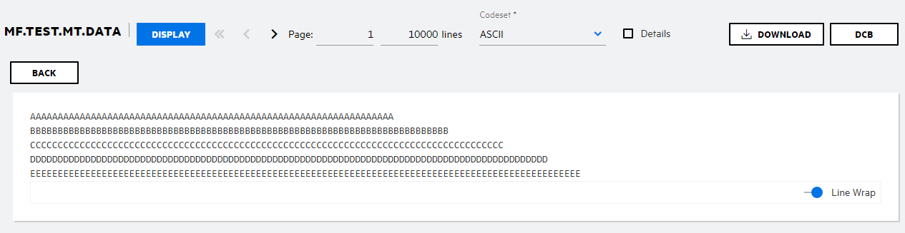
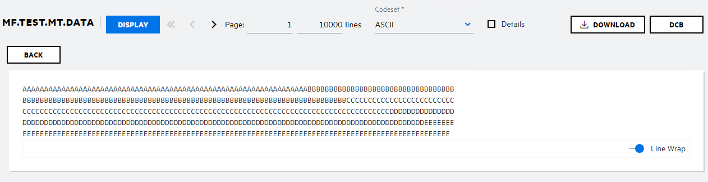

# MFFTP catalogues FB files incorrectly
## Environment
Enterprise Developer / Server  
Windows  

## Situation
Data corruption occurs when using MFFTP to GET a line sequential '.txt' file, the length of the records in the Windows ".txt" file is less than the length of the allocated "FB" file in MFES. The file is then catalogued incorrectly in Enterprise Server as the catalogued FB shows that each record is filled with continuous characters containing multiple records from the transferred '.txt' file.  

For example, it should look like this when catalogued:  



But instead, it looks like this:  



## Resolution
Set the following MFFTP control variables either in the '//ENVVAR   DD *' section, within Enterprise Server Administration or in a dataset called FTP.DATA  

```
MFFTP_SENDEOL=CRLF
MFFTP_PROCESS_TRAILS_ONGET=FALSE
```

For example:  

```
//ENVVAR DD *
MFFTP_SENDEOL=CRLF
MFFTP_PROCESS_TRAILS_ONGET=FALSE
```